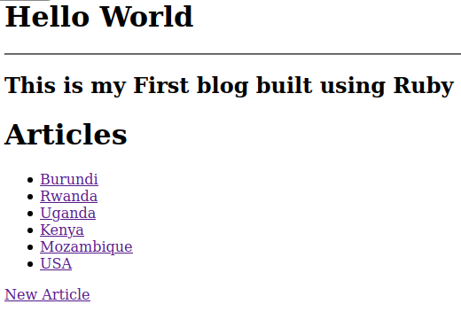

# Blog

## Table of Contents
  <br />

* [About the Project](#about-the-project)
* [Built With](#built-with)
* [Contributing](#contributing)
* [Author](#author)
* [Acknowledgements](#acknowledgements) 

#
<br />

[](https://forthebadge.com) </br>


<br />

#


<!-- ABOUT THE PROJECT   -->
## About The Project

This project is about blog where a user can create a post and add comments to it. 

## Screenshot Test
#
<p align="center">
  
</p>

#

### Built With

* [RUBY]
* [RAILS]

## Contributing

Contributions make the open-source community such an amazing place to learn, inspire, and create. Any contributions you make are **greatly appreciated**.

## Prequisites

Ruby & Rails installed on your local machine.
bundle installed on your machine
Terminal or similar to execute the program.


## Getting Started

using this blog app you will be able add, view, edit and delete articles.

## Clone project

- To get a local copy up and running follow these simple example steps.
- Clone this repository with git clone ```https://github.com/uwadonat/blog_app.git``` using your terminal or command line.
- Change to the project directory by entering: ```cd blog``` in the terminal.


## How to use the Blog app
1. run the command ```bundle install```   This will install the required dependencies
2. run the command ```rails db:create```. This will initialize the necessary migration files
3. run the command ```rails db:migrate``` 
4. run the command ```rails s```
5. open the link ```http://127.0.0.1:3000``` in your brouser this will open the blog in your browser then enjoy the blog by adding, viewing, editing or deleting articles.


## Author

👤 Donat UWAMAHORO

- Github: [@uwadonat](https://github.com/uwadonat)
- LinkerdIn: [@uwadonat](https://www.linkedin.com/in/uwadonat/)


<!-- ACKNOWLEDGEMENTS -->
## Acknowledgements

* [Microverse](https://www.microverse.org/)

## 📝 License

This project is [MIT](https://choosealicense.com/licenses/mit/) licensed.

